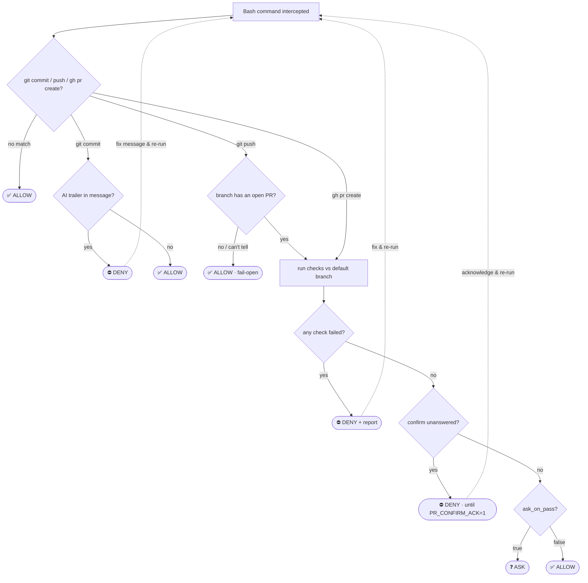

# pr-guard

> A [Claude Code](https://claude.com/claude-code) **PreToolUse hook** that stops a bad commit, push, or PR before it ships — and tells the agent exactly how to fix it.

It runs as a subprocess on every Bash command Claude issues, acts on three — `git commit`, `git push`, `gh pr create` — checks them against your repo's rules, and returns one of three verdicts:

| | |
|---|---|
| ✅ **ALLOW** | runs untouched |
| ❓ **ASK** | shows a report, waits for you |
| ⛔ **DENY** | blocked, with the reason and the fix |

The rules live in one small file per repo (`.claude/pr.json`) — the hook itself is generic and shared.

---

## What it checks

- **no AI trailer** — rejects `Co-Authored-By: Claude` / "Generated with Claude" / 🤖 in commit & PR messages
- **fresh branch** — denies when your branch is behind the default branch
- **version bumped** — denies unless the *version value* in a declared file actually changed (a stray edit to the file — e.g. a dependency tweak — doesn't count)
- **lint clean** — runs your lint command and denies on failure
- **confirm gates** — hard-stops on judgment calls (e.g. "does this need a dependency bump?") until they're explicitly acknowledged

Everything is opt-in per repo. A check is on **because you configured it** — omit the key and it's off.

---

## How a command is judged



Every **DENY** is a loop, not a wall: the agent reads the report, fixes the issue (or runs the named skill), and re-issues the command — the hook re-checks the new state.

---

## Repository layout

```
hooks/pr-guard.py        the hook — copies straight to ~/.claude/hooks/
examples/                ready-to-copy pr.json configs
  pr.json                  full example with every key
  python-service.json      lint + version bump (ruff / pyproject)
  frontend.json            lint + version bump (pnpm / package.json)
  docs-or-scripts.json     minimal (AI-trailer only)
tests/test_pr_guard.py   dependency-free tests for the core logic
.claude/pr.json          this repo's own config (so it guards itself)
```

The repo mirrors where things land: `hooks/` → `~/.claude/hooks/`, and you copy one file from `examples/` into your repo's `.claude/`.

## Install

**1. Drop the hook in your Claude config:**

```bash
mkdir -p ~/.claude/hooks
cp hooks/pr-guard.py ~/.claude/hooks/pr-guard.py
```

**2. Register it once in `~/.claude/settings.json`:**

```json
{
  "hooks": {
    "PreToolUse": [{
      "matcher": "Bash",
      "hooks": [{ "type": "command", "command": "python3 ~/.claude/hooks/pr-guard.py" }]
    }]
  }
}
```

**3. Add a `.claude/pr.json` to each repo you want guarded** (see below).

> A repo with **no** `.claude/pr.json` has its commits/PRs **denied** — every guarded repo must declare its rules first. For a repo you barely want to gate, drop in a minimal config (see `examples/docs-or-scripts.json`).

---

## Configure · `.claude/pr.json`

One principle: **a check is on because its config is present** — no separate toggle map. A few keys still have defaults (listed just below).

```jsonc
{
  "main_branch": "main",                       // optional, default "master"
  "lint": "pnpm lint",                         // a command → run it; omit → skip
  "require_version_bump": ["package.json"],    // version value must change vs main
  "confirm": [                                 // judgment prompts (hard-gated)
    "Does this PR need a newer shared library build? If so run /your-fix-skill first."
  ],
  "bump_hint": "Run /your-fix-skill to fix the version, then retry.", // shown on a deny
  "ask_on_pass": true                          // clean run: ask (true) or proceed (false)
}
```

### Defaults — what you get if you omit a key

The hook is useful with an almost-empty config because sensible defaults apply:

| Key | Default if omitted |
|-----|--------------------|
| `main_branch` | `master` |
| `block_ai_trailer` | **on** |
| `refresh_branch` | **on** |
| `ask_on_pass` | **ask** |
| `require_version_bump` | off (no files) |
| `lint` | off (no command) |
| `confirm` | none |

So `{ }` alone already blocks AI trailers and stale branches against `master`. If your default branch is `main`, set `"main_branch": "main"` — that's the one default people most often need to override.

### Every key

| Key | Type | What it does |
|-----|------|--------------|
| `main_branch` | string | Branch to compare against. Default `master`. |
| `block_ai_trailer` | bool | Reject AI-credit trailers. On by default; set `false` to allow. |
| `refresh_branch` | bool | Require the branch be current with main. On by default. |
| `require_version_bump` | string[] | List version files → the version *value* in one must change vs main. Omit / `[]` → off. |
| `lint` | string | Lint command → run it. Omit / `null` → off. |
| `confirm` | string[] | Judgment prompts, hard-gated by `PR_CONFIRM_ACK=1`. Name a skill/command (e.g. `/your-fix-skill`) so the agent knows how to resolve it. |
| `bump_hint` | string | Optional pointer to the fix, printed on a deny — e.g. `"Run /your-fix-skill, then retry."` |
| `ask_on_pass` | bool | On a clean, acknowledged run: ask the human (`true`) or let the agent proceed (`false`). Default `true`. |

See [`examples/`](examples/) for ready-to-copy configs.

---

## Behavior, in detail

**`git commit`** — only the AI-trailer check. Clean → allowed. (Chaining `git commit && git push` in one command is denied: the commit isn't applied yet when the hook runs, so the push checks would read stale state. Run them separately.)

**`git push`** — acts **only if the branch has an open PR**. No PR → nothing happens. This is what catches a branch that went stale, or a version that clashed, *after* the PR was opened and main moved on.

**`gh pr create`** — the full check set before the PR opens.

**Confirm gates** — a `confirm` prompt is a *hard* deny, not a soft prompt, because a soft prompt gets auto-cleared without the question ever being answered. Re-run the exact command with a `PR_CONFIRM_ACK=1` prefix once it's genuinely addressed:

```bash
PR_CONFIRM_ACK=1 git push origin my-branch
```

**`ask_on_pass`** — on a run where everything passed and confirms are acknowledged, choose to pause for a human (`true`) or let the agent proceed silently (`false`). Failures and unanswered confirms always deny, regardless.

---

## What it is — and isn't

✅ A **best-effort guardrail** for the common mistakes, on the agent's git path. Fast, deterministic, fails open so a bug never bricks git.

🚫 **Not a security boundary.** It guards the Bash path; it can't stop a determined bypass (a shell alias, a non-Bash git integration). The `PR_CONFIRM_ACK` token is an audit nudge, not an enforced control — treat it as a reminder, not a lock.

Design principles baked in:

- **Fails open, blocks closed** — errors and unreachable lookups allow; only deliberate checks deny.
- **Parse, don't grep** — it parses the command into real argv, so a git verb inside a string or `echo` never false-matches.
- **Network-light** — one `gh pr view` + one `git fetch` per gated push; never a package-registry lookup in the critical path.
- **Repo-agnostic core** — all variation lives in `pr.json`; the hook is shared.

---

## Tests

Pure-function tests for the command parser and config normalizer, no dependencies:

```bash
python3 tests/test_pr_guard.py
```

---

## Migrating an older config

The legacy shape still works untouched — a nested `"checks": { … : false }` toggle map, the old `"version_files"` name (now `require_version_bump`), and `"verbose"` (now `ask_on_pass`) are all normalized automatically. Move to the flat schema whenever; nothing breaks.
